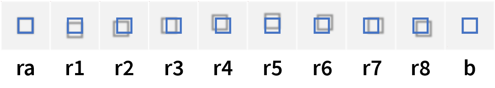

# Virtual Raking Light

Simulate a moving raking light in your browser using OpenSeadragon.

Move your mouse to move the light across a painting or any other object photographed with raking light. 

Supports both simple images and tile sources such as DZI and IIIF. Implemented in pure HTML/CSS/JS.

## Image arrangement

By default you'll need:
- 1 raking-all image (*ra*) for the center; 
- 8 uniformly spaced raking images (*r1–8*); and 
- 1 regular image (such as a beauty light photograph *b*) which is used to persistently fill in the shadows.

If you have more or fewer than 8 directions, simply modify `rakingAngles` and `rakingDeltaDegrees` accordingly. For sets with non-uniform spacing such as {0°, 10°, 40°, 70°, ..}, you'll need to modify the code. Feel free to make a pull request if you do :-)

For the center image you can use a regular image instead of a raking-all image to achieve a lights-on, lights-off effect when you move the mouse to the center. If you do so, make sure to omit the shadow in-fill image (the last image in `urls`).

## Local setup

Pull the repo.

Use the included example images or edit `urls` in `index.html` to point to your own images*.
 
*The code is currently set to use simple images (JPG's), but it also supports tile sources such as DZI and IIIF.

Run a local server** and open index.html in a browser.
 
**[Live Server for VSCode](https://marketplace.visualstudio.com/items?itemName=ritwickdey.LiveServer) is a useful option.

## To-do's

See TODO flags in index.html.

## Credits and license

Created by Lars Maxfield.

Licensed under GPU GPL v3 or later.

Uses elements of [openseadragon-opacity-slider](https://github.com/WasMachenSachen/openseadragon-opacity-slider) by Tim Loges et al. Licensed under BSD-3-Clause. 
