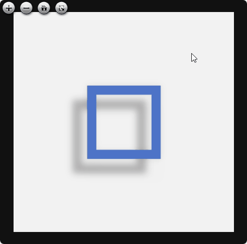

# Virtual Raking Light

Simulate a moving raking light in your browser using OpenSeadragon.

Move your mouse to move the light across a painting or any other object photographed with raking light. Requires 8 directional raking images and 1 raking-all image and/or 1 regular image. 

Supports simple images and tile sources such as DZI and IIIF. Implemented in pure HTML/CSS/JS.

## Local setup

Pull the repo.

Use the included example images or edit `urls` in `index.html` to point to your own images*.
 
*The code is currently set to use simple images (JPG's), but it also supports tile sources such as DZI and IIIF.

Run a local server** and open index.html in a browser.
 
**[Live Server for VSCode](https://marketplace.visualstudio.com/items?itemName=ritwickdey.LiveServer) is a useful option.

## To-do's

See TODO flags in index.html.

## Credits and license

Created by Lars Maxfield.

Licensed under GPU GPL v3 or later.

Uses elements of [openseadragon-opacity-slider](https://github.com/WasMachenSachen/openseadragon-opacity-slider) by Tim Loges et al. Licensed under BSD-3-Clause. 
